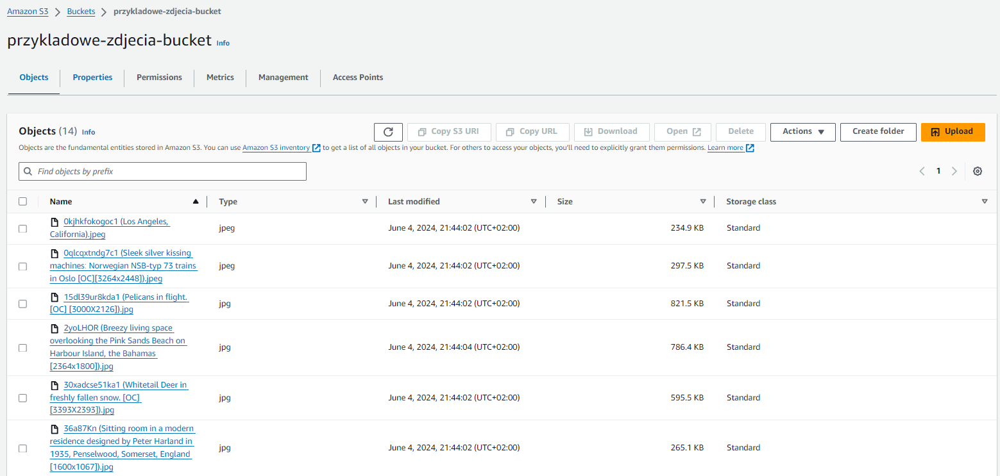
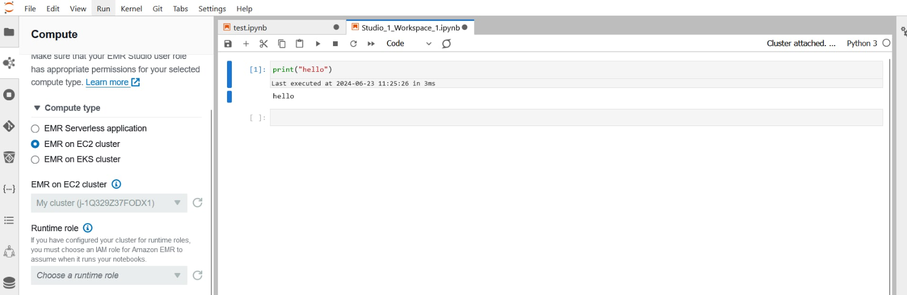

# Project Phase Report: AWS Management

## Introduction

The goal of this project phase was to set up the AWS environment, upload data, and prepare the AWS EMR cluster for working with Apache Spark. This process involved collaborating with the team responsible for downloading images, configuring security policies, creating the EMR cluster, and installing Apache Spark on the cluster.

## Tasks Completed

### 1. Data Upload to AWS

Collaboration with the image downloading team: We worked with the team responsible for downloading images to ensure that the data was correctly uploaded to AWS S3.

#### Process

1. Creating an S3 bucket for data storage.
2. Uploading images to the bucket.

### 2. Security Policy Configuration

Securing data access: We configured IAM policies to ensure data access security.

#### Process

1. Creating an IAM role with appropriate permissions for S3 and EMR access.
2. Creating an IAM user with the necessary permissions for work.

### 3. AWS EMR Configuration

We prepared the EMR cluster for data analysis using Apache Spark.

#### Process

1. Creating the EMR cluster.
2. Configuring the cluster's instances and settings.

### 4. Installing Apache Spark on the Cluster

We installed Apache Spark on the EMR cluster and prepared the environment for data analysis.

#### Process

1. Installing Spark on the EMR cluster (automatically installed when creating the cluster with the Spark application).
2. Configuring Spark for optimal performance.
  
### 5. Integrating EMR Studio with Jupyter Notebook

We integrated EMR Studio with Jupyter Notebook for conducting interactive data analyses.

## Workflow

1. **AWS S3**: Data (image) storage.
2. **AWS IAM**: Managing resource access.
3. **AWS EMR**: Data analysis using Apache Spark.
4. **EMR Studio**: Creating and running Spark applications.
5. **Jupyter Notebook**: Interactive data analyses.

## Summary

In this project phase, we successfully set up the AWS environment, uploaded data, and prepared the AWS EMR cluster for working with Apache Spark. This setup will allow us to proceed with data analysis and result visualization in the subsequent project phases.
